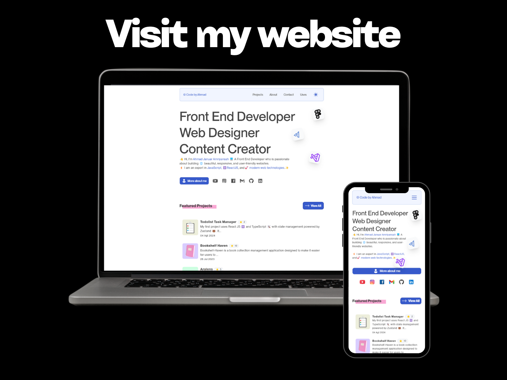

# 🎨 Portofolio Website

Welcome to my GitHub portfolio! Here, you will find projects that reflect my interests and expertise in Front End Development. Each project featured is the result of learning, experimenting, and implementing modern technologies, especially in interactive web application development.

## 🚀 About Me

Hello! I am Ahmad Januar Amriyansah, a fresh graduate from Universitas Teknokrat Indonesia with a Bachelor's degree in Informatics. I have experience in web development using JavaScript and various other supporting technologies such as ReactJS, TypeScript, and Next.js. I am enthusiastic to continue learning and contributing to the world of Front End Development.

## 💻 Technology Used

- **JavaScript / TypeScript**
- **Next.js**
- **React Hooks** - `useState`, `useEffect`, `useContext`, `useReducer`
- **Tailwind CSS**
- **Firebase**
- **SWR**

## 📞 Contact

- **LinkedIn**: [Ahmad Januar Amriyansah](https://linkedin.com/in/ahmad-januar)
- **Email**: ahmadjanuaramri@gmail.com

Thank you for visiting my portfolio! If you have any suggestions, feedback, or would like to collaborate, please feel free to contact me.s
